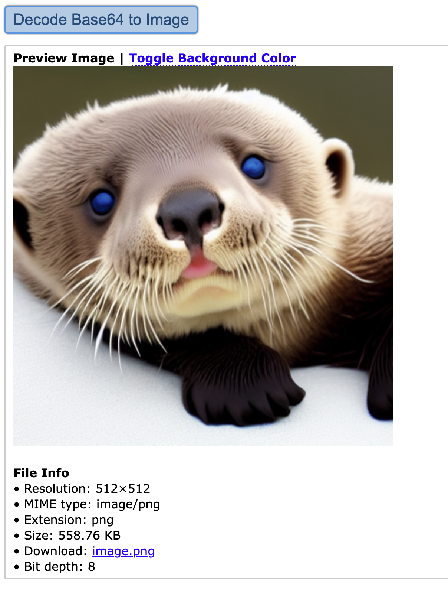

# Stable-Diffusion-API-Server

This project is a RESTful API server that provides image generation and editing services based on Stable Diffusion models.

## Setup

- Install WasmEdge v0.14.1-rc.1

  ```bash
  curl -sSf https://raw.githubusercontent.com/WasmEdge/WasmEdge/master/utils/install_v2.sh | bash -s -- -v 0.14.1-rc.1 --nowasilogging
  ```

- Install `wasmedge_stablediffusion` and `wasmedge_logging` plugins

  ```bash
  # Download stable diffusion plugin for Mac Apple Silicon
  curl -LO https://github.com/WasmEdge/WasmEdge/releases/download/0.14.1-rc.1/WasmEdge-plugin-wasmedge_stablediffusion-0.14.1-rc.1-darwin_arm64.tar.gz

  # Unzip the plugin to $HOME/.wasmedge/plugin
  tar -xzf WasmEdge-plugin-wasmedge_stablediffusion-0.14.1-rc.1-darwin_arm64.tar.gz -C $HOME/.wasmedge/plugin

  # Download logging plugin for Mac Apple Silicon
  curl -LO https://github.com/WasmEdge/WasmEdge/releases/download/0.14.1-beta.2/WasmEdge-plugin-wasi_logging-0.14.1-beta.2-darwin_arm64.tar.gz

  # Unzip the plugin to $HOME/.wasmedge/plugin
  tar -xzf WasmEdge-plugin-wasi_logging-0.14.1-beta.2-darwin_arm64.tar.gz -C $HOME/.wasmedge/plugin
  ```

## Build

```bash
cargo build --target wasm32-wasip1 --release
```

`sd-api-server.wasm` will be generated in `target/wasm32-wasip1/release/`.

## Run

- Download the stable diffusion model

  ```bash
  curl -LO https://huggingface.co/second-state/stable-diffusion-v-1-4-GGUF/resolve/main/stable-diffusion-v1-4-Q8_0.gguf
  ```

  The available stable diffusion models:

  - [second-state/stable-diffusion-v-1-4-GGUF](https://huggingface.co/second-state/stable-diffusion-v-1-4-GGUF)
  - [second-state/stable-diffusion-v1-5-GGUF](https://huggingface.co/second-state/stable-diffusion-v1-5-GGUF)
  - [second-state/stable-diffusion-2-1-GGUF](https://huggingface.co/second-state/stable-diffusion-2-1-GGUF)

- Start the server

  ```bash
  wasmedge --dir .:. sd-api-server.wasm --model-name sd-v1.4 --gguf stable-diffusion-v1-4-Q8_0.gguf
  ```

  > `sd-api-server` will use `8080` port by default. You can change the port by adding `--socket-addr <ip-address>:<port>`.

## Usage

### Image Generation

- Send a request for image generation

  ```bash
  curl -X POST 'http://localhost:8080/v1/images/generations' \
    --header 'Content-Type: application/json' \
    --data '{
        "model": "sd-v1.4",
        "prompt": "A cute baby sea otter"
    }'
  ```

  If the request is handled successfully, the server will return a JSON response like the following:

  ```json
  {
    "created": 1723431133,
    "data": [
        {
            "url": "/archives/file_74f514a2-8d33-4f9d-bcc0-42e8db14ecbc/output.png",
            "prompt": "A cute baby sea otter"
        }
    ]
  }
  ```

- Preview the generated image

<div align=center>

</div>

### Image Editing

- Send a request for image editing

  ```bash
  curl --location 'http://localhost:10086/v1/images/edits' \
    --form 'image=@"otter.png"' \
    --form 'prompt="A cute baby sea otter with blue eyes"'
  ```

  If the request is handled successfully, the server will return a JSON response like the following:

  ```json
  {
    "created": 1723432689,
    "data": [
        {
            "url": "/archives/file_554e4d53-6072-4988-83e6-fe684655a734/output.png",
            "prompt": "A cute baby sea otter with blue eyes"
        }
    ]
  }
  ```

- Preview the edited image

<div align=center>

</div>
